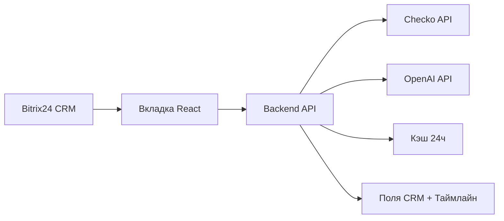

# Проверка контрагента для Bitrix24 CRM

Приложение для Bitrix24 CRM: проверка контрагентов по ИНН через [Checko API](https://checko.ru/integration/api), AI-анализ рисков через OpenAI и отображение результатов во вкладке карточки **сделки** и **лида**.

## Возможности

- Вкладка **«Проверка контрагента»** в карточках CRM (сделка, лид)
- Получение данных из Checko: реквизиты, финансы, судебные дела, исполнительные производства
- AI-анализ через OpenAI (gpt-4o-mini)
- Кнопка **«Проверить контрагента»** для ручного запуска проверки
- Сохранение результата в пользовательское поле CRM
- Запись в таймлайн сделки/лида
- Кэширование результата на 24 часа

## Структура проекта

```
/
├── backend/          # Node.js + Express API
├── frontend/         # React + TypeScript виджет вкладки CRM
├── shared/           # Общие типы и константы
├── bitrix-app/       # Манифест локального приложения
├── Dockerfile
├── docker-compose.yml
└── README.md
```

## Требования

- Node.js 20+
- Docker и Docker Compose (для деплоя)
- Аккаунт [Checko](https://checko.ru) с API-ключом
- Аккаунт OpenAI с API-ключом
- Портал Bitrix24 с правами на установку REST-приложений

## Переменные окружения

Скопируйте `.env.example` в `.env` и заполните значения:

| Переменная | Описание |
|---|---|
| `CHECKO_API_KEY` | API-ключ Checko |
| `OPENAI_API_KEY` | API-ключ OpenAI (`sk-…`) |
| `OPENAI_MODEL` | Модель OpenAI (по умолчанию `gpt-4o-mini`) |
| `APP_URL` | Публичный URL приложения после деплоя |
| `BITRIX_CLIENT_ID` | Client ID OAuth-приложения Bitrix24 |
| `BITRIX_CLIENT_SECRET` | Client Secret OAuth-приложения |
| `BITRIX_INN_FIELD_DEAL` | Поле ИНН в сделке (по умолчанию `UF_CRM_INN`) |
| `BITRIX_INN_FIELD_LEAD` | Поле ИНН в лиде |
| `BITRIX_RESULT_FIELD_DEAL` | Поле для JSON-результата в сделке |
| `BITRIX_RESULT_FIELD_LEAD` | Поле для JSON-результата в лиде |
| `CACHE_TTL_HOURS` | Время жизни кэша (по умолчанию 24) |

> **Безопасность:** не храните ключи в коде. Используйте только `.env` или секреты платформы деплоя. Если ключи были опубликованы — перевыпустите их.

## Локальная разработка

```bash
# Установка зависимостей
npm install

# Сборка shared
npm run build -w shared

# Запуск backend + frontend
npm run dev
```

- Backend: `http://localhost:3000`
- Frontend (dev): `http://localhost:5173`

## Сборка

```bash
npm run build
npm start
```

## Деплой через Docker

```bash
cp .env.example .env
# отредактируйте .env

docker compose up -d --build
```

Проверка: `GET /api/health`

## Деплой на Railway

1. Загрузите код в GitHub-репозиторий.
2. В [Railway](https://railway.app) создайте новый проект и подключите репозиторий.
3. Railway автоматически обнаружит `Dockerfile` и соберёт контейнер.
4. В настройках проекта добавьте переменные окружения из `.env.example`.
5. Railway выдаст URL вида `https://your-app.up.railway.app`.
6. Укажите этот URL в `APP_URL` в переменных окружения Railway.
7. Обновите URL обработчика в локальном приложении Bitrix24 на новый `APP_URL`.

## Установка в Bitrix24

### 1. Создайте локальное приложение

1. Bitrix24 → **Разработчикам** → **Другое** → **Локальное приложение**.
2. Тип: **Серверное**, с использованием REST API.
3. Включите scope: `crm`, `placement`.
4. **Путь вашего обработчика:** `{APP_URL}/placement/`
5. **Путь для первоначальной установки:** `{APP_URL}/install/`
6. Скопируйте `client_id` и `client_secret` в `.env`.

### 2. Установите приложение на портал

Откройте `{APP_URL}/install/authorize` — пройдёт OAuth и автоматически зарегистрируются вкладки:

- `CRM_DEAL_DETAIL_TAB` — «Проверка контрагента»
- `CRM_LEAD_DETAIL_TAB` — «Проверка контрагента»

### 3. Настройте поле ИНН в CRM

Создайте пользовательское поле **ИНН** в сделках и лидах (или укажите существующее поле в `.env`).

При установке приложение попытается создать поле `UF_CRM_CHECKO_RESULT` для хранения JSON-результата.

## Использование

1. Откройте карточку сделки или лида.
2. Перейдите на вкладку **«Проверка контрагента»**.
3. Убедитесь, что в карточке заполнен **ИНН**.
4. Нажмите **«Проверить контрагента»**.

Приложение:

1. Прочитает ИНН из поля CRM
2. Запросит данные в Checko (компания, финансы, суды, ФССП)
3. Выполнит AI-анализ через OpenAI
4. Обновит вкладку
5. Сохранит результат в пользовательское поле
6. Добавит запись в таймлайн

## API Backend

### `POST /api/check`

Запуск проверки контрагента.

```json
{
  "entityType": "deal",
  "entityId": 123,
  "forceRefresh": true,
  "auth": {
    "domain": "your-portal.bitrix24.ru",
    "accessToken": "..."
  }
}
```

### `POST /api/saved`

Загрузка сохранённого результата из поля CRM.

### `GET /api/health`

Проверка работоспособности сервиса.

## Архитектура



## Лицензия

MIT
